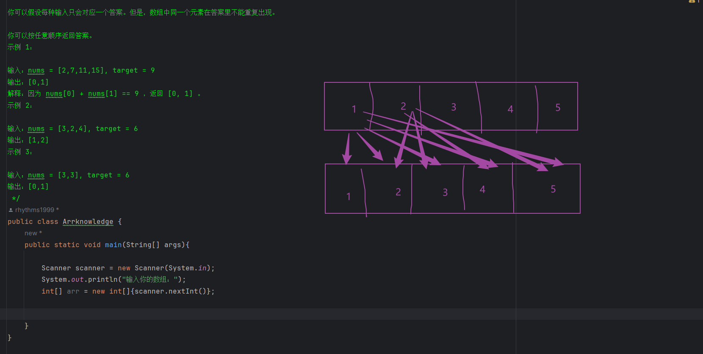
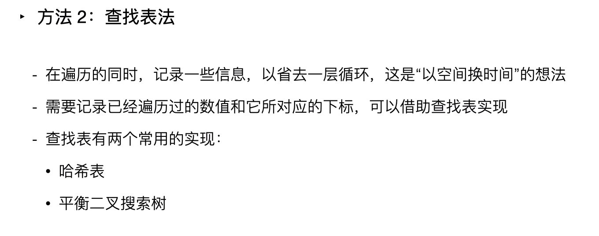
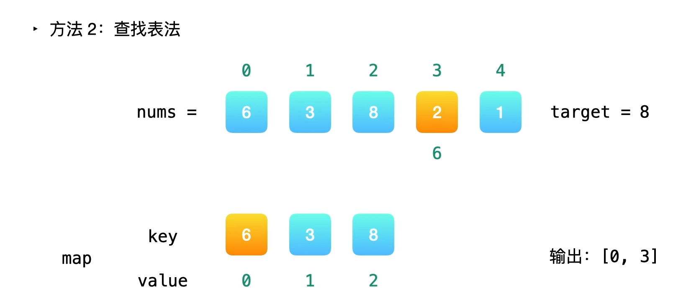

### 解法一：暴力解法
- 利用双层循环遍历数组
- --   
    public class Arrknowledge {
    // 定义一个名为Arrknowledge的公共类
    public static void main(String[] args) {
    // 主方法，程序的入口点
    int[] nums = {2, 7, 11, 15}; // 创建一个整型数组nums，包含元素2, 7, 11, 15
    int target = 15; // 定义目标值为15
    System.out.println(Arrays.toString(twoSum(nums, target))); // 调用twoSum方法并打印结果到控制台
    }

    // 定义一个名为twoSum的公共静态方法，返回类型为整型数组，接收一个整型数组nums和一个目标值target作为参数
    public static int[] twoSum(int[] nums, int target) {
        // 使用两层循环遍历数组nums
        for (int i = 0; i < nums.length - 1; i++) {
            // 外层循环，遍历数组nums中的元素，注意遍历到倒数第二个元素即可
            for (int j = i + 1; j < nums.length; j++) {
                // 内层循环，遍历i后面的元素，避免重复计算
                if (nums[i] + nums[j] == target) {
                    // 如果找到两个元素的和等于目标值
                    return new int[]{i, j}; // 返回包含i和j的整型数组
                }
            }
        }
        // 若未找到符合条件的两个元素，返回null
        return null; 
    }
    }
- --

- Arrays.toString(): 这是Java中Arrays类的一个静态方法，用于将数组转换为字符串形式。在这里，我们调用了toString()方法来将数组转换为字符串。
- 在Java中，使用static修饰方法表示该方法属于类而不是对象实例。当一个方法不需要依赖于特定对象的状态或数据，而只是针对输入参数进行计算并返回结果时，通常会将该方法声明为static方法。

### 解法二：查找表法
> 假如 nums1 是其中一个数字，那么另一个数字一定是 target - nums1

> 因为不需要维护查找表中元素的顺序，所以可以选择哈希表

- 6之前没有元素与之对应，所以直接将元素6和对应的下标0存入哈希表
- 8-3=5，5不在哈希表中，将元素3和对应下标1存入哈希表
- 一直到第四个数字，8-2=6，6之前有存入哈希表中，因此6和2就是我们要找的俩个元素
- 初始化哈希表的时候尽量指定容量，以避免哈希表扩容所带来的性能消耗
- 这一题哈希表的长度可以定义为 length-1？
  - 我猜测最后的数据并不需要存入表中，可以直接拿来比较
